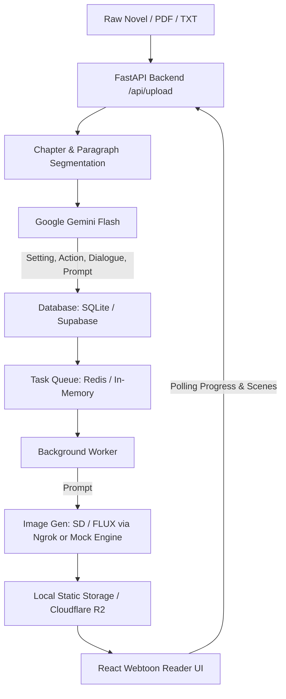

# 🎨 ManhwaAI — Novel to Webtoon Comic Engine

[](https://fastapi.tiangolo.com)
[](https://reactjs.org/)
[](https://vitejs.dev/)
[](https://ai.google.dev/)
[](https://python.org)
[](LICENSE)

**ManhwaAI** is an AI-powered pipeline that transforms raw text novels, stories, `.txt` files, and `.pdf` manuscripts into continuous, vertical-scrolling Korean webtoon (manhwa) comic strips.

It breaks novel chapters into discrete scenes, uses **Google Gemini** to analyze settings, character actions, and dialogue, queues rendering tasks asynchronously, and displays the resulting panels on a webtoon reader with dynamic speech bubbles and narration overlays.

---

## ✨ Features

- 📖 **Multi-Format Input**: Upload `.txt` files, `.pdf` documents, or paste raw manuscript text directly.
- 🖼️ **Comic PDF Support**: Detects pre-illustrated comic PDFs and extracts full-page panels directly into the reader.
- ✂️ **Smart Chapter & Scene Splitting**: Automatically parses chapter headings and splits stories into sequential scene paragraphs.
- 🧠 **Gemini Scene Decomposition**:
  - Extracts background setting, mood, and atmosphere.
  - Identifies character positions, facial expressions, and poses.
  - Extracts verbatim dialogue for HTML speech bubble overlays.
  - Builds targeted visual prompts for comic image generation (FLUX / Stable Diffusion).
- ⚡ **Asynchronous Task Queue**: Uses Redis / Upstash (with an automatic in-memory fallback) to process image generation in the background.
- 📱 **Immersive Webtoon Reader**:
  - Vertical-scroll manhwa canvas with active panel tracking.
  - Dynamic speech bubbles with character speaker tails.
  - Narration text cards and chapter progress indicator.
  - Fullscreen mode and individual panel retry for failed generations.
- 📚 **Novel Bookshelf**: Visual archive to save, browse, reload, and manage generated works.
- 🛡️ **Zero-Friction Local Fallback**: Works locally without external cloud dependencies (falls back to SQLite and local mock generation).

---

## 🏗️ Architecture & Pipeline



---

## 📂 Repository Structure

```
editor/
├── backend/
│   ├── app/
│   │   ├── config.py       # Pydantic environment configuration
│   │   ├── database.py     # Database adapter (Supabase & SQLite fallback)
│   │   ├── gemini.py       # Google Gemini scene analysis & prompt generator
│   │   ├── main.py         # FastAPI routes, file parser & static hosting
│   │   ├── queue.py        # Redis & local memory queue manager
│   │   └── worker.py       # Background image processing worker
│   ├── static/             # Generated comic panels and static assets
│   ├── .env.example        # Environment variables template
│   ├── local.db            # SQLite local database (generated on first run)
│   └── requirements.txt    # Python backend dependencies
├── frontend/
│   ├── public/             # Static public assets
│   ├── src/
│   │   ├── components/
│   │   │   ├── ReaderView.jsx  # Vertical-scrolling webtoon comic reader
│   │   │   └── UploadView.jsx  # Manuscript upload, edit & novel shelf
│   │   ├── App.jsx         # Main application shell
│   │   ├── index.css       # Design system, glassmorphism & comic styling
│   │   └── main.jsx        # React DOM entrypoint
│   ├── package.json        # Frontend dependencies & scripts
│   └── vite.config.js      # Vite configuration
├── .gitignore              # Git ignore rules for Python, Node, DB & secrets
└── README.md               # Project documentation
```

---

## 🚀 Getting Started

### Prerequisites

- **Python**: 3.10 or higher
- **Node.js**: v18.0 or higher
- **npm** or **yarn** / **pnpm**
- *(Optional)* **Gemini API Key**: [Google AI Studio](https://aistudio.google.com/)
- *(Optional)* **Redis** / **Upstash** & **Supabase** account

---

### 1. Backend Setup

1. Open a terminal and navigate to the `backend` folder:
   ```bash
   cd backend
   ```

2. Create and activate a Python virtual environment:
   - **Windows (PowerShell)**:
     ```powershell
     python -m venv venv
     .\venv\Scripts\Activate.ps1
     ```
   - **Linux / macOS**:
     ```bash
     python3 -m venv venv
     source venv/bin/activate
     ```

3. Install Python dependencies:
   ```bash
   pip install -r requirements.txt
   ```

4. Configure environment variables:
   ```bash
   cp .env.example .env
   ```
   Open `backend/.env` and adjust the variables according to your setup:
   - To test instantly with **mock generation** (no external API keys needed), leave `MOCK_IMAGE_GEN=True`.
   - To use real AI generation, set `MOCK_IMAGE_GEN=False`, add your `GEMINI_API_KEY`, and provide your `IMAGE_GEN_URL`.

5. Start the FastAPI development server:
   ```bash
   uvicorn app.main:app --reload --host 0.0.0.0 --port 8000
   ```
   The backend API will be available at: `http://localhost:8000` (Swagger docs at `http://localhost:8000/docs`).

---

### 2. Frontend Setup

1. Open a new terminal and navigate to the `frontend` folder:
   ```bash
   cd frontend
   ```

2. Install Node dependencies:
   ```bash
   npm install
   ```

3. Start the Vite development server:
   ```bash
   npm run dev
   ```
   Open your browser at `http://localhost:5173`.

---

## ⚙️ Configuration Reference (`.env`)

| Variable | Required | Default / Fallback | Description |
| :--- | :---: | :--- | :--- |
| `GEMINI_API_KEY` | Optional | Heuristics parser | Google Gemini API key used to parse scenes, actions, and dialogues. |
| `MOCK_IMAGE_GEN` | Optional | `True` | When `True`, generates placeholder panels locally with a 5s delay. |
| `IMAGE_GEN_URL` | Optional | `""` | Ngrok / API endpoint pointing to your Stable Diffusion / FLUX model server. |
| `REDIS_URL` | Optional | In-memory queue | Redis TCP connection URI (e.g. `redis://localhost:6379`). |
| `UPSTASH_REDIS_REST_URL` | Optional | `""` | Upstash Redis REST endpoint. |
| `UPSTASH_REDIS_REST_TOKEN`| Optional | `""` | Upstash Redis REST bearer token. |
| `SUPABASE_URL` | Optional | SQLite (`local.db`) | Supabase PostgreSQL project URL. |
| `SUPABASE_KEY` | Optional | `""` | Supabase API anon/service role key. |
| `R2_BUCKET_NAME` | Optional | Local disk (`/static`) | Cloudflare R2 / S3 bucket name. |

---

## 🔌 API Endpoints Summary

| Method | Endpoint | Description |
| :--- | :--- | :--- |
| `GET` | `/` | Healthcheck and server mode status |
| `POST`| `/api/extract-text` | Extracts text / comic pages from uploaded `.txt` or `.pdf` |
| `POST`| `/api/upload` | Parses novel chapters, creates database rows, and queues scene jobs |
| `GET` | `/api/chapters/{id}/scenes` | Retrieves all scenes, prompts, dialogues, and image URLs |
| `GET` | `/api/chapters/{id}/status` | Returns real-time progress statistics (% completed, failed, pending) |
| `POST`| `/api/scenes/{id}/retry` | Re-queues a failed scene for generation |
| `GET` | `/api/novels` | Lists all saved novels and chapters for the bookshelf view |
| `DELETE`| `/api/novels/{id}` | Deletes a novel and all associated chapters/scenes |
| `GET` | `/static/{filename}` | Serves locally generated comic panel images |

---

## 📤 Pushing to Git

To push this repository to GitHub or GitLab for the first time:

1. **Initialize Git in the root directory**:
   ```bash
   git init
   ```

2. **Stage your files** (secrets in `.env`, generated images, and `node_modules` will be safely ignored via `.gitignore`):
   ```bash
   git add .
   ```

3. **Verify staged files**:
   ```bash
   git status
   ```

4. **Make the initial commit**:
   ```bash
   git commit -m "Initial commit: ManhwaAI novel-to-comic engine"
   ```

5. **Link and push to your remote repository**:
   ```bash
   git branch -M main
   git remote add origin https://github.com/<your-username>/<your-repo-name>.git
   git push -u origin main
   ```

---

## 📄 License

Distributed under the MIT License. See `LICENSE` for more information.
